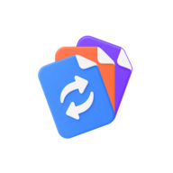

<div align="center">
  

  # 转个格式

  **简单、可靠、好看的 Android 本地文件格式转换工具。**

  <p>
    <a href="#-下载">下载</a> ·
    <a href="#-使用指南">使用指南</a> ·
    <a href="#-开发指南">开发指南</a> ·
    <a href="https://github.com/henjicc/SwiftFormat/issues">问题反馈</a>
  </p>

  [](https://github.com/henjicc/SwiftFormat/releases/latest)
  [](https://github.com/henjicc/SwiftFormat/actions/workflows/release.yml)
  [](https://github.com/henjicc/SwiftFormat/releases)
  [](https://github.com/henjicc/SwiftFormat/stargazers)
</div>

---

## 目录

- [项目介绍](#-项目介绍)
- [主要功能](#-主要功能)
- [下载](#-下载)
- [使用指南](#-使用指南)
- [系统要求](#-系统要求)
- [技术栈](#-技术栈)
- [开发指南](#-开发指南)
- [项目结构](#-项目结构)
- [路线图](#-路线图)
- [常见问题](#-常见问题)
- [许可证与开源组件](#-许可证与开源组件)

## 📖 项目介绍

转个格式是一款面向普通用户的 Android 本地格式转换工具，主要处理图片、视频和音频。

它希望解决这些问题：

- 不需要先判断文件类型，选择文件后自动按图片、视频、音频分组。
- 不需要理解 CRF、码率、采样率、编码器 Profile 等专业参数。
- 不上传、不登录，默认全部在设备本地完成转换。

适合以下用户：

- 想把图片、视频或音频快速转成常见格式的普通用户。
- 需要一次处理多个文件，但不想打开复杂转码软件的用户。
- 重视本地处理、隐私和 Android 原生体验的用户。

> 当前状态：开发中，核心链路已可构建和测试，仍在做发布前质量验证。

## ✨ 主要功能

| 功能 | 说明 | 状态 |
|---|---|---|
| 混合文件选择 | 支持从系统文件选择器选择多个图片、视频、音频文件，也支持系统分享入口 | 已完成 |
| 自动识别与分组 | 自动识别媒体类型，并按图片 / 视频 / 音频分组展示 | 已完成 |
| 统一参数设置 | 每组只暴露格式、质量、尺寸三个普通用户能理解的概念 | 已完成 |
| 本地批量转换 | 使用原生图片能力、Media3 Transformer 与隔离 FFmpeg 引擎完成转换 | 已完成 |
| 进度与后台任务 | 支持转换进度页、前台服务通知、取消、重试和任务恢复 | 已完成 |
| 历史与结果操作 | 支持打开、分享、查看位置、再次转换、删除结果和删除历史 | 已完成 |
| 主题与语言 | 支持简体中文 / 英文、浅色 / 深色 / 跟随系统、强调色选择 | 已完成 |
| 发布质量验证 | 多设备、性能、低内存和更多集成测试仍需持续补齐 | 进行中 |

## 📥 下载

最新安装包会发布在 GitHub Releases：

<div align="center">

[](https://github.com/henjicc/SwiftFormat/releases/latest)

[查看全部版本与更新记录](https://github.com/henjicc/SwiftFormat/releases)

</div>

| 平台 | 文件类型 | 下载地址 |
|---|---|---|
| Android | `.apk` | [前往最新版本](https://github.com/henjicc/SwiftFormat/releases/latest) |

安装说明：

1. 下载 Release 页面中的 `.apk` 文件。
2. 在 Android 设备上打开安装包。
3. 按系统提示允许“安装未知来源应用”后完成安装。

## 🚀 使用指南

1. 打开应用，点击“选择文件”。
2. 选择一个或多个图片、视频、音频文件。
3. 应用会自动分组，分别设置输出格式、质量和尺寸。
4. 点击“开始转换”，在进度页查看状态。
5. 转换完成后，可以打开、分享或查看文件位置。

默认输出目录为 `Download/转个格式`。应用默认不覆盖原文件，也不会自动删除原文件。

## 💻 系统要求

| 项目 | 最低要求 | 推荐配置 |
|---|---|---|
| 操作系统 | Android 8.0（API 26） | Android 12 及以上 |
| 存储空间 | 预留足够的转换输出空间 | 大文件转换建议预留源文件数倍空间 |
| 其他 | 可访问系统文件选择器 | 建议允许通知权限，以便后台转换时查看进度 |

## 🧩 技术栈

- **语言 / UI**：Kotlin、Jetpack Compose、Material 3
- **状态与导航**：ViewModel、StateFlow、Navigation Compose
- **持久化**：DataStore、Room
- **文件访问**：Storage Access Framework、ContentResolver、MediaStore
- **图片转换**：ImageDecoder、Bitmap、HeifWriter / AvifWriter
- **音视频转换**：Jetpack Media3 Transformer
- **扩展格式**：隔离的 FFmpeg 兼容层
- **后台任务**：Foreground Service、WorkManager
- **构建工具**：Gradle Kotlin DSL、Version Catalog

## 🛠️ 开发指南

### 环境要求

- JDK 17
- Android Studio 或 Android SDK 命令行工具
- Gradle Wrapper（仓库已包含）

### 获取源码

```bash
git clone https://github.com/henjicc/SwiftFormat.git
cd SwiftFormat
```

### 构建 Debug 安装包

```bash
./gradlew assembleDebug
```

Windows：

```powershell
.\gradlew.bat assembleDebug
```

构建产物位于：

```text
app/build/outputs/apk/debug/
```

### 运行测试与检查

```bash
./gradlew testDebugUnitTest lintDebug
```

Windows：

```powershell
.\gradlew.bat testDebugUnitTest lintDebug
```

### 发布自动化

仓库包含 GitHub Actions workflow：`.github/workflows/release.yml`。

触发方式：

- 推送形如 `v1.0.0` 的 tag。
- 在 GitHub Actions 页面手动运行 workflow，并填写 release tag。

发布 workflow 会运行单元测试、Lint、构建 Release APK/AAB、使用 GitHub Secrets 签名，然后把安装包上传到 GitHub Releases。

需要在仓库 Settings -> Secrets and variables -> Actions 中配置：

| Secret | 说明 |
|---|---|
| `SIGNING_KEYSTORE_BASE64` | 发布 keystore 文件的 Base64 内容 |
| `SIGNING_KEY_ALIAS` | keystore alias |
| `SIGNING_STORE_PASSWORD` | keystore store password |
| `SIGNING_KEY_PASSWORD` | key password |

## 📁 项目结构

```text
SwiftFormat/
├── app/                   # Android 应用源码
│   └── src/main/java/com/henjicc/swiftformat/
│       ├── core/          # 通用模型、文件、数据库、设置、设计系统
│       ├── conversion/    # 转换任务编排与输出位置解析
│       ├── engine/        # 图片、Media3、FFmpeg 等转换引擎
│       ├── feature/       # 首页、进度、历史、设置等界面
│       └── service/       # 前台服务与清理任务
├── tasks/                 # 项目任务拆解与进度主依据
├── ref/                   # 需求规格与 UI 设计参考
├── gradle/                # Gradle Wrapper 与版本配置
└── README.md              # 项目说明
```

## 🗺️ 路线图

- [x] Compose / Material 3 工程底座
- [x] 文件选择、分享入口、媒体识别和缩略图
- [x] 图片、音频、视频转换引擎接入
- [x] 后台转换、通知、历史记录和结果操作
- [x] 设置页、主题、语言、开源组件与隐私说明
- [ ] 多设备、16KB 页面、低内存和横竖屏专项验证
- [ ] 性能 pass 与更多集成 / UI 测试
- [ ] 发布签名、版本管理和正式渠道分发

详细开发计划见 [`tasks/OVERVIEW.md`](tasks/OVERVIEW.md)。

## ❓ 常见问题

<details>
<summary><strong>转换会上传我的文件吗？</strong></summary>

不会。第一版默认全部在设备本地完成转换，不要求登录，也不上传文件。

</details>

<details>
<summary><strong>为什么没有显示 CRF、码率、采样率等参数？</strong></summary>

转个格式面向普通用户，界面只提供格式、质量、尺寸这三个统一概念。专业参数由底层引擎根据媒体类型和设备能力自动映射。

</details>

<details>
<summary><strong>Release workflow 为什么需要签名密钥？</strong></summary>

Android Release 安装包必须签名后才适合分发。workflow 只从 GitHub Secrets 读取密钥，不会把 keystore 或密码提交到仓库。

</details>

## 📄 许可证与开源组件

当前仓库尚未提供独立 `LICENSE` 文件。应用内“设置 -> 关于 -> 开源组件”列出了 AndroidX、Material 3、Coil、Media3、Room、DataStore 与 FFmpegKit 16KB 兼容 fork 等依赖及其许可证信息。

其中 FFmpeg 相关原生库随应用分发时按 GPL-3.0 相关要求提供对应源代码链接，详见应用内开源组件说明。

---

<div align="center">

如果这个项目对你有帮助，可以给它一个 Star。

**转个格式 · 让格式转换少一点麻烦。**

</div>
